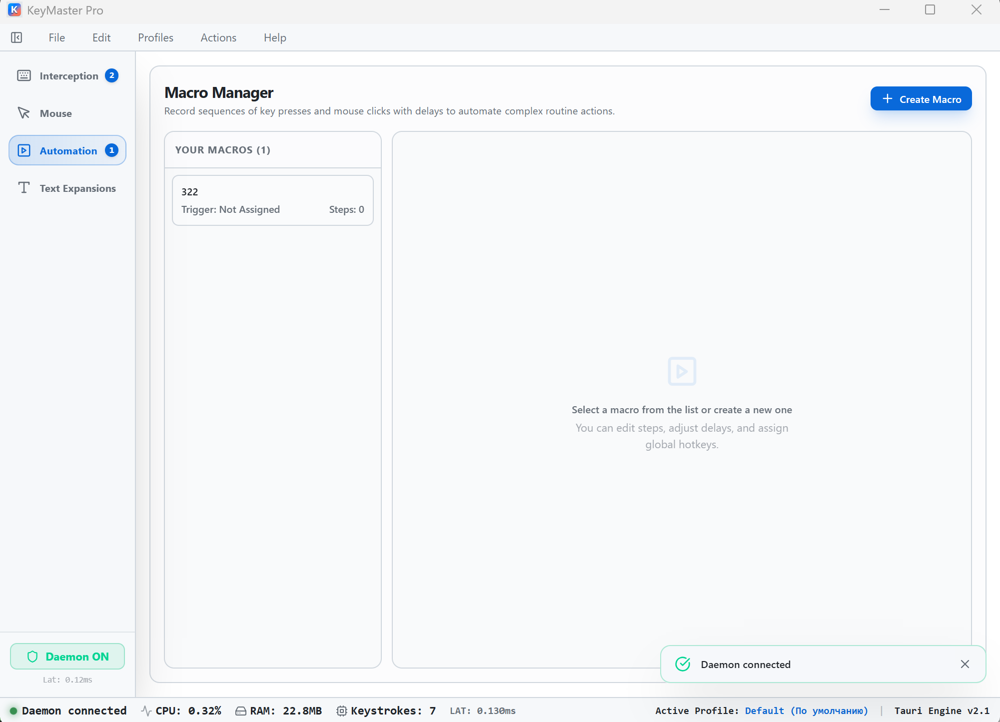

<!-- 🇷🇺 Русский | 🇬🇧 [English](README.md) -->

<div align="center">

# ⌨️ KeyMaster Pro

**Современная утилита автоматизации клавиатуры для Windows**

[](LICENSE)
[](https://github.com/zsanya322-maker/keymaster-pro)
[](https://v2.tauri.app)
[](https://www.rust-lang.org)
[](https://react.dev)

[📥 Скачать](#-скачать) · [✨ Возможности](#-возможности) · [🛠️ Сборка](#%EF%B8%8F-сборка-из-исходников) · [🛡️ Безопасность](#%EF%B8%8F-безопасность--ложные-срабатывания) · [💬 Сообщество](#-сообщество)

</div>

---

## 📝 О проекте

**KeyMaster Pro** — это мощное настольное приложение для Windows, которое позволяет переназначать клавиши, записывать макросы, создавать текстовые расширения и автоматизировать рутинные задачи — всё через чистый современный интерфейс.

Построено на **Rust + Tauri v2 + React 19**. Работает на уровне ОС через `SetWindowsHookEx`, перехватывая и переназначая ввод в реальном времени, с **полным отсутствием логирования** и минимальным потреблением памяти (~23 МБ ОЗУ, <1% ЦП).

> Ищете **бесплатную, открытую альтернативу** AutoHotkey, PowerToys Keyboard Manager или Key Manager? Вы её нашли.

---

## 📸 Скриншот

<div align="center">



</div>

---

## ✨ Возможности

| Функция | Описание |
|---------|----------|
| 🎹 **Переназначение клавиш** | Любая клавиша или комбинация → другая клавиша, действие или запуск программы |
| 🖱️ **Переназначение мыши** | Перенастройка кнопок и колеса мыши |
| 🔥 **Слои** | Контекстное переназначение — как слои QMK для клавиатуры |
| ⚡ **Макросы** | Запись нажатий и кликов с задержками, воспроизведение в любое время |
| 📝 **Текстовые расширения** | Аббревиатуры разворачиваются в полные текстовые фрагменты |
| 🔄 **Профили приложений** | Автоматическое переключение профилей по активному окну |
| 🚀 **Архитектура Демон** | Лёгкий фоновый процесс + GUI (двухпроцессная архитектура) |
| 📊 **Мониторинг в реальном времени** | ЦП, ОЗУ, задержка и счётчик нажатий в строке состояния |
| 🎨 **Современный интерфейс** | Чистый дизайн на Radix UI + TailwindCSS |
| 🌐 **Мультиязычность** | Русский и английский интерфейс (i18next) |

---

## 📥 Скачать

### Вариант A: Установщик (рекомендуется для большинства)

➡️ Перейдите в [**Releases**](https://github.com/zsanya322-maker/keymaster-pro/releases) и скачайте `KeyMaster-Pro-Setup-x.x.x.exe`

- **Не нужны** зависимости — просто скачайте и запустите
- WebView2 Runtime предустановлен на Windows 10/11 (автоскачивание при отсутствии)
- Установщик поддерживает **автообновление** через GitHub

### Вариант B: Портативная версия

Скоро — портативная версия `.zip` планируется в будущих релизах.

---

## 🛠️ Сборка из исходников

### Предварительные требования

1. **Node.js** 18+ и **pnpm** (`npm i -g pnpm`)
2. **Rust** 1.70+ ([rustup.rs](https://rustup.rs))
3. **Visual Studio Build Tools** — рабочая нагрузка: `Microsoft.VisualStudio.Workload.VCTools`
   - Скачать: https://visualstudio.microsoft.com/visual-cpp-build-tools/

### Шаги

```bash
# Клонировать репозиторий
git clone https://github.com/zsanya322-maker/keymaster-pro.git
cd keymaster-pro

# Установить зависимости фронтенда
pnpm install

# Запуск в режиме разработки
pnpm tauri dev

# Сборка бинарника (.exe)
pnpm tauri build
```

Готовый установщик появится в `src-tauri/target/release/bundle/nsis/`.

---

## 🏗️ Технологический стек

| Уровень | Технология |
|---------|-----------|
| **Бэкенд** | Rust + Tauri v2 |
| **Фронтенд** | React 19 + TypeScript 5 + Vite 6 |
| **UI** | Radix UI + TailwindCSS 4 + Lucide Icons |
| **Состояние** | Zustand 5 |
| **i18n** | i18next (RU + EN) |
| **Хуки ввода** | SetWindowsHookEx (`WH_KEYBOARD_LL`, `WH_MOUSE_LL`) через windows-rs |
| **IPC** | Named Pipes + JSON-RPC 2.0 |
| **Хранилище** | Локальные JSON-файлы (`%APPDATA%\KeyMaster Pro\`) |

---

## 🛡️ Безопасность и ложные срабатывания

Поскольку KeyMaster Pro использует низкоуровневые Win32 API для перехвата и переназначения ввода (`SetWindowsHookEx`), некоторые антивирусы могут ошибочно помечать его как кейлоггер или инструмент инъекции ввода. **Это ложное срабатывание.**

**Наши гарантии безопасности:**

1. **Отсутствие логирования ввода** — Приложение **не сохраняет, не записывает и не передаёт** ваши нажатия клавиш. Вся обработка происходит в реальном времени, в оперативной памяти.
2. **Офлайн-first** — Все конфигурации хранятся локально в формате JSON в `%APPDATA%`. Никакого облака, никакой телеметрии.
3. **Отсутствие скрытой сетевой активности** — Единственный сетевой запрос — проверка обновлений через HTTPS на GitHub.

*Если Windows Defender или антивирус блокирует приложение, добавьте `KeyMasterPro.exe` в список исключений.*

---

## 🗺️ Roadmap

| Статус | Функция |
|--------|---------|
| ✅ Готово | Переназначение клавиш/мыши, макросы, слои, текстовые расширения, профили, системный трей, автозапуск с Windows, тёмная тема, сворачивание в трей |
| 🔄 Далее | Портативная сборка (.zip), сертификат для подписи кода, доработка UI настроек |
| 📋 В планах | Движок скриптов Rhai, браузерное расширение, система плагинов, дистрибуция через winget |

---

## 🤝 Участие в разработке

Мы приветствуем вклад! Вот как помочь:

1. Сделайте форк репозитория
2. Создайте ветку функции: `git checkout -b feature/amazing-feature`
3. Закоммитьте: `git commit -m 'Add amazing feature'`
4. Запушьте: `git push origin feature/amazing-feature`
5. Откройте Pull Request

Нашли баг? [Откройте issue](https://github.com/zsanya322-maker/keymaster-pro/issues).

---

## 💬 Сообщество

- 📱 **Telegram:** [@KeyM_Pro](https://t.me/KeyM_Pro)
- 🐛 **Баг-репорты:** [GitHub Issues](https://github.com/zsanya322-maker/keymaster-pro/issues)
- 💬 **Обсуждения:** [GitHub Discussions](https://github.com/zsanya322-maker/keymaster-pro/discussions)

---

## 📜 Лицензия

Этот проект распространяется по лицензии **Fair Core License (FCL)** — исходный код открыт, но защищён от конкурентного использования. Подробности в [LICENSE](LICENSE).

1 января 2030 года лицензия автоматически конвертируется в MIT.

---

<div align="center">

<sub>Сделано с ❤️ на Rust, Tauri и React</sub>

<sub>

**Ключевые слова:** переназначение клавиш Windows, ремаппинг клавиатуры, альтернатива AutoHotkey, альтернатива PowerToys, запись макросов, текстовые расширения, автоматизация ввода, Tauri приложение, утилита Rust для Windows, макросы клавиатуры, переназначение мыши, программа для переназначения клавиш

</sub>

</div>
